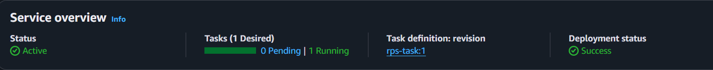
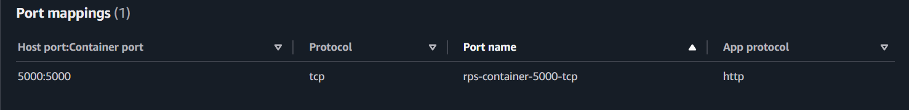
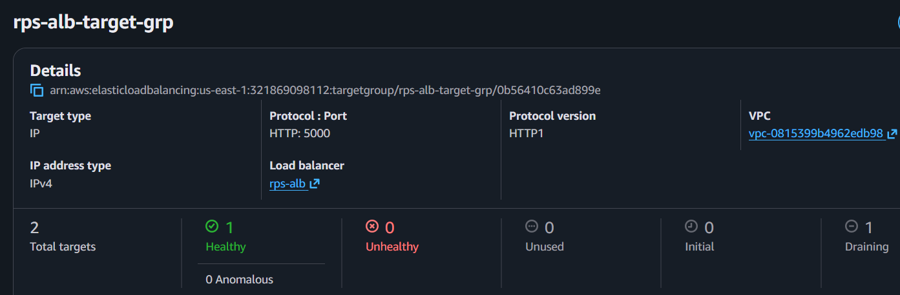
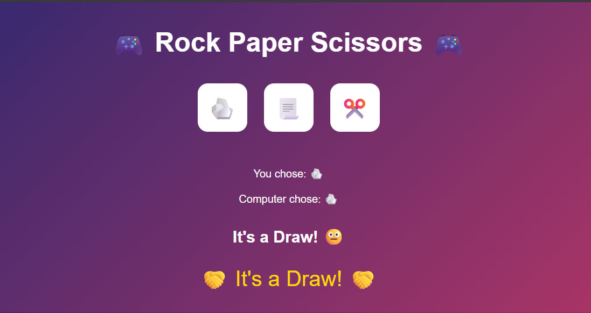
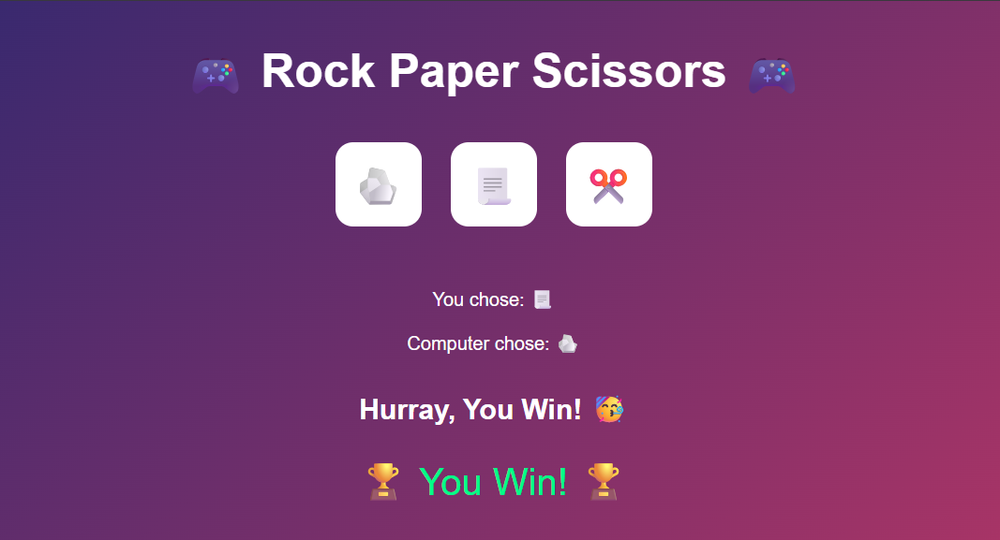
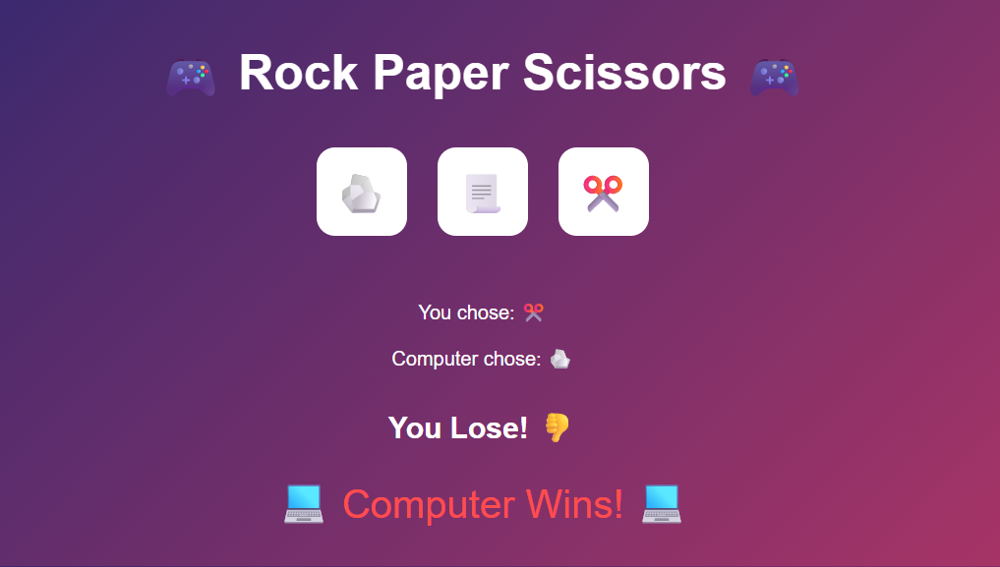

# 🎮 Rock-Paper-Scissors Game Web App (Docker + AWS ECS)

## 📄 Project Summary  
This project is a production-style deployment of a **Rock–Paper–Scissors** web application built with **Python and Flask**, containerized using **Docker**, and deployed on **AWS ECS (Fargate)** behind an **Application Load Balancer**.

The project demonstrates real-world container deployment, networking, and debugging practices used in cloud-native environments.

---

## 🚀 About the Project  
* **Simple Gameplay:** Play Rock-Paper-Scissors against the computer.
* **Web Application:** Lightweight Flask-based backend with embedded UI.
* **Containerization:** Docker image built and published to Docker Hub.
* **AWS Deployment:** Application deployed on AWS ECS using Fargate (serverless containers).
* **Load Balanced:** Public access via Application Load Balancer with health checks.
* **Observability:** Logs streamed to Amazon CloudWatch.

---

## 🛠️ Technical Stack
* **Backend:** Python 3.9
* **Web Framework:** Flask
* **Containerization:** Docker
* **Container Registry:** Docker Hub
* **Compute:** AWS ECS (Fargate)
* **Networking:** Application Load Balancer, Security Groups
* **Logging:** Amazon CloudWatch Logs

---

## 📁 Project Structure
```text
RPS-Web-App/
├── Dockerfile
├── game.py
├── requirements.txt
├── README.md
└── screenshots/
```

---

## 👨‍💻 Step-by-Step Workflow
### 🔹 Step 1: Build & Run Locally with Docker

Build Image
```bash
docker build -t vaibhavnalla0202/rps-web-game:latest .
```

Run Container
```bash
docker run -p 5000:5000 vaibhavnalla0202/rps-web-game:latest
```

Open in browser:
```code
http://localhost:5000
```

Push Image to Docker Hub
```bash
docker push vaibhavnalla0202/rps-web-game:latest
```

---

## 🔹 Step 2: Deploy on AWS ECS (Fargate)

### High-level deployment steps:

1. Created an ECS Cluster using Fargate

2. Defined a Task Definition using the Docker Hub image

3. Configured container port 5000

4. Created an ECS Service with:

    - Application Load Balancer

    - Target group health checks

    - Proper security group separation (ALB → ECS)

5. Enabled CloudWatch logging for the container

##### The application is publicly accessible via the ALB DNS endpoint.

---

## 🔐 Security Group Design (Key Learning)

#### ALB Security Group
    Allows inbound HTTP (80) from the internet

#### ECS Task Security Group

    Allows inbound TCP 5000 only from ALB security group

##### This follows AWS best practices and prevents direct public access to containers.

---

## 🐳 Docker Commands Cheat Sheet
```bash
# List images
docker images

# List running containers
docker ps

# Stop container
docker stop <container_id>

# Remove container
docker rm <container_id>

# Remove image
docker rmi <image_id>
```

---

## 📚 Key Learnings

1. Containerizing Python web applications using Docker

2. Deploying containers on AWS ECS with Fargate

3. Configuring ALB health checks and target groups

4. Debugging 504 Gateway Timeout issues

5. Designing secure networking with AWS security groups

6. Observability using CloudWatch logs

---

## 📸 Output











